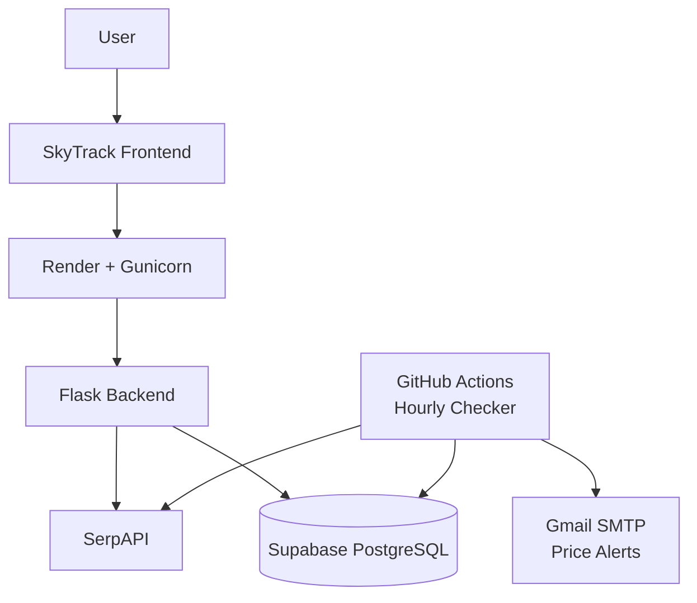
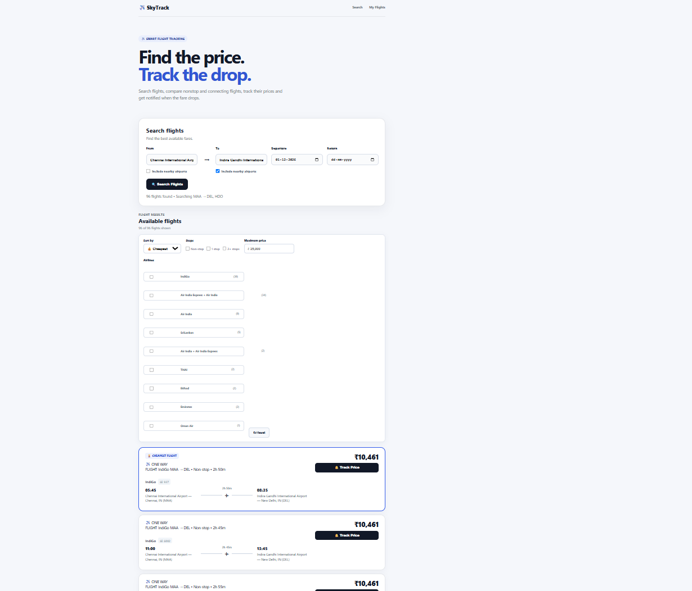

# ✈️ SkyTrack — Flight Price Tracker


A full-stack flight price tracking application built with Flask and JavaScript.

SkyTrack lets users search flights, compare prices, track specific routes, view price history, and receive email alerts when prices drop or reach a target price.

## ✨ Features

- ✈️ Search flights using airport codes
- 🔄 One-way and round-trip searches
- 🛫 Connecting flight and layover information
- 📍 Nearby airport search
- 💰 Sort and compare flight prices
- 🔔 Track flights with target price alerts
- 📉 New lowest-price alerts
- 📊 Historical price charts
- 📧 Email notifications
- ⏰ Automated hourly price checking
- 🔐 Environment-based secret management
- 🗄️ Persistent PostgreSQL database
- 🧪 Automated tests with pytest
- ⚙️ GitHub Actions CI/CD
- 🚀 Production deployment with Gunicorn


## 🛠️ Tech Stack


### Backend

- Python
- Flask
- Gunicorn
- SerpAPI
- PostgreSQL
- Supabase


### Frontend

- HTML
- CSS
- JavaScript
- Chart.js


### Testing & Automation

- pytest
- GitHub Actions
- GitHub Actions Scheduled Workflows


### Deployment

- Render
- Supabase PostgreSQL


## 🏗️ Architecture




## 🔄 Data Flow

1. **User** searches for a flight through the SkyTrack frontend.
2. **Flask Backend** processes the request.
3. **SerpAPI** retrieves current flight information and prices.
4. **Supabase PostgreSQL** stores tracked flights and price history.
5. **GitHub Actions** runs `checker.py` automatically every hour.
6. **Gmail SMTP** sends an alert when the target price is reached.


## 📸 Preview



## 📂 Project Structure

```text
flight-price-tracker/
│
├── app.py
├── checker.py
├── db.py
├── validation.py
├── requirements.txt
├── render.yaml
├── README.md
├── skytrack-preview.png
│
├── data/
│   └── airports.csv
│
├── services/
│   ├── airports.py
│   └── flight_api.py
│
├── static/
│   ├── app.js
│   └── style.css
│
├── templates/
│   └── index.html
│
├── tests/
│   ├── test_airports.py
│   ├── test_db.py
│   ├── test_flight_api.py
│   ├── test_routes.py
│   └── test_validation.py
│
└── .github/
    └── workflows/
        ├── ci.yml
        └── flight-checker.yml
```


## 🚀 Deployment

SkyTrack is deployed using:

- **Render** — Flask web application
- **Supabase** — persistent PostgreSQL database
- **GitHub Actions** — automated hourly flight price checks
- **Gmail SMTP** — email price alerts


### Live Application

[https://flight-price-tracker-30xk.onrender.com](https://flight-price-tracker-30xk.onrender.com)

## 🧪 Testing

The project includes automated tests using pytest.

Run the tests locally:

```bash
python -m pytest
```

The test suite covers:

- Airport services
- Database functionality
- Flight API
- Flask routes
- Input validation


## 🔐 Environment Variables

The application uses environment variables for sensitive credentials.

```text
SERPAPI_KEY
DATABASE_URL
SMTP_HOST
SMTP_PORT
SMTP_USERNAME
SMTP_PASSWORD
```

Secrets are never stored directly in the source code.

## ⚙️ Automated Price Checking

GitHub Actions runs `checker.py` automatically every hour.

The checker:

1. Retrieves tracked flights from the database.
2. Searches for the latest flight price.
3. Updates the price history.
4. Updates the lowest/current price.
5. Sends an email alert when the target price is reached.


## 📈 Price Tracking

For each tracked flight, SkyTrack stores:

- Departure airport
- Arrival airport
- Outbound date
- Return date
- Target price
- Current price
- Lowest price
- Price history
- Tracking timestamp

This allows users to monitor how flight prices change over time.

## 🔔 Price Alerts

Users can set a target price for a tracked flight.

When the checker detects that the flight price has reached the target, SkyTrack can send an email notification through Gmail SMTP.

## 🔒 Security

Sensitive credentials are managed through environment variables and GitHub Actions secrets.

The repository does not store:

- API keys
- Database passwords
- SMTP passwords
- Other private credentials


## 🤝 Project Goals

SkyTrack was built to demonstrate practical full-stack development skills, including:

- REST API integration
- Backend development with Flask
- Frontend development with JavaScript
- Database design and persistence
- Automated testing
- CI/CD
- Scheduled background processing
- Email automation
- Cloud deployment
- Environment-based configuration


## 📄 License

This project is available for educational and portfolio purposes.